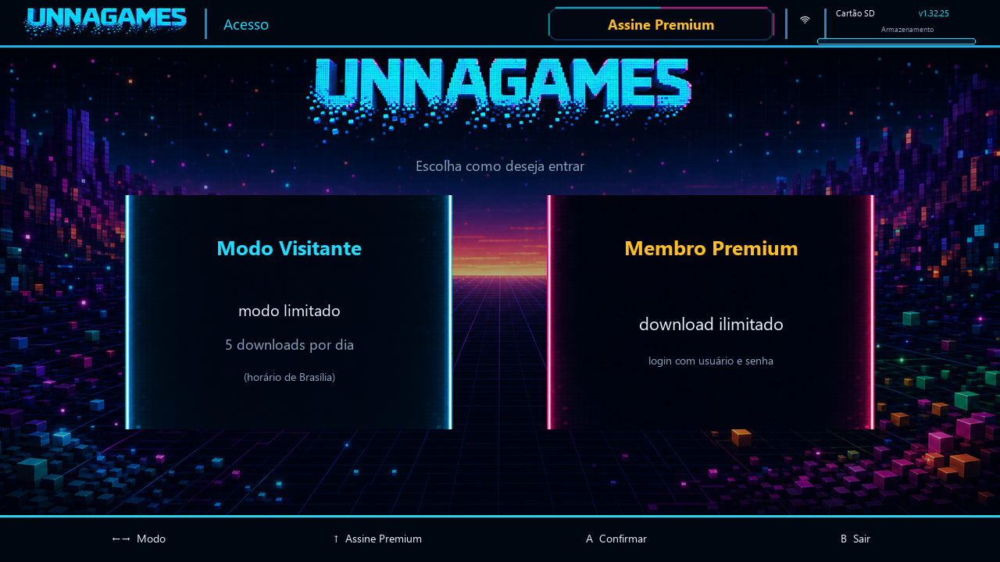

# UnnaGames

Homebrew para Nintendo Switch (Atmosphere / Homebrew Menu).

Este repositório publica **somente o `.nro` já compilado** para download. O código-fonte e o restante do ecossistema não ficam aqui.

## Tela de acesso

<p align="center">
  
  <br><em>Escolha entre Modo Visitante e Membro Premium</em>
</p>

## Obrigatório: Tico

Para a UnnaGames funcionar corretamente, é **obrigatório** ter o homebrew **Tico** instalado no Switch.

- Sem o Tico, a UnnaGames **não** roda os jogos convertidos / emulados como esperado.
- Instale o Tico **antes** de usar a UnnaGames.
- Coloque o Tico no cartão SD (pasta usual do Homebrew Menu, por exemplo `sdmc:/switch/`) e confirme que ele abre normalmente.

## Como instalar a UnnaGames

1. Instale o **Tico** (obrigatório).
2. Baixe `UnnaGames.nro` na [página de Releases](../../releases/latest).
3. Copie para o cartão SD em:
   ```
   sdmc:/switch/UnnaGames/UnnaGames.nro
   ```
4. Abra pelo **Homebrew Menu**.

## Versão atual

Veja a [última release](../../releases/latest) para versão, notas e SHA-256 do arquivo.

## Aviso

Uso por sua conta e risco. Respeite as leis da sua região.
